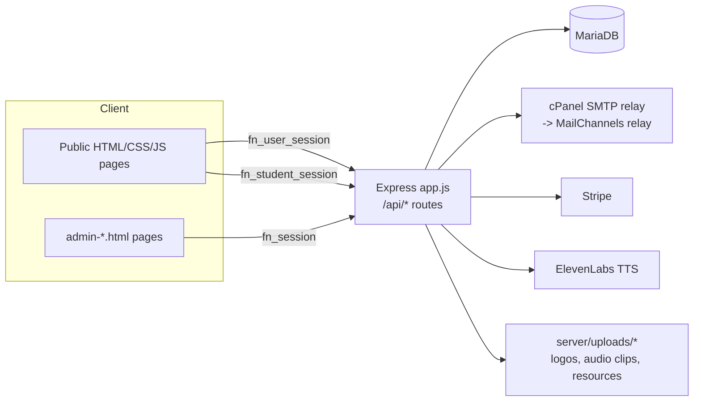

# Current-State Architecture — Fixer Nation Education (FNE)

**Purpose:** ground-truth reference for the Tune Your Brain blueprint verification. Every claim below was confirmed against the repository or live production on 2026-09-16 — see file/route/table citations inline. Where the blueprint's own remembered facts differ from what's actually here, that's called out explicitly rather than silently corrected.

## 1. System context

- Runtime: Node.js (`server/package.json` engines `>=18`) + Express `^4.19.2`, MariaDB via `mysql2` `^3.11.0`. No local dev environment exists anywhere for this project; all verification happens against production, per `CLAUDE.md`.
- Frontend: flat HTML/CSS/vanilla JS, no build step, no bundler, no `package.json` at repo root.
- Hosting: Hosting.com shared cPanel account (`fixernat`), LiteSpeed web server, Passenger/Node app manager. Deploy is `git push` (local machine) → `git pull` (cPanel Terminal) → `rsync` static files → nodevenv-activated `npm install`/migration scripts → manual Node-app restart via the cPanel panel. No SSH, no pm2, no Docker, no CI (`.github/workflows` does not exist).
- Two independent test suites: `tests/e2e/` (59 Playwright specs, `tests/playwright.config.ts`, `baseURL` defaults to production, run manually — confirmed no CI wiring) and a separate `tests/package.json`.

## 2. Identity, session, and tenancy — the three-cookie model

| Cookie | Constant | Defined | Middleware | Identity |
|---|---|---|---|---|
| `fn_session` | `COOKIE_NAME` | `server/lib/session.js:3` | `requireAuth`/`getAuthUser` (`server/middleware/auth.js:6-25`) | Single FNE admin account |
| `fn_user_session` | `SITE_COOKIE_NAME` | `server/lib/session.js:9` | **No shared middleware** — every route calls `getSiteUser(req)` directly (e.g. `server/routes/brain-games.js:164-174`) | Teachers, school/district admins, parents, members — all `site_users` rows |
| `fn_student_session` | `STUDENT_COOKIE_NAME` | `server/lib/session.js:14` | `requireStudentAuth` (`server/middleware/studentAuth.js:5-24`) | Classroom-PIN students — `classroom_students` rows, **no FK to `site_users`** |

**Correction against this repo's own `CLAUDE.md`:** the root `CLAUDE.md` architecture table describes a `requireSiteAuth` middleware for site-user routes. `server/middleware/siteAuth.js` was a second, unused `requireSiteAuth` implementation deleted as dead code in a prior session (confirmed zero imports at the time) — that specific file is correctly gone. Site-user auth is ad hoc `getSiteUser(req)` calls in several route files (`brain-games.js`, `social.js`, `parent-invite.js`, `school-invite.js`).

**UPDATE 2026-09-17 — this section had a real error, corrected while building Phase 5.** A genuine, actively-used `requireSiteAuth` middleware DOES exist — defined in `server/routes/site-auth.js` (not the deleted `middleware/siteAuth.js`), and already imported by `server/routes/classrooms.js`, `server/routes/parent.js`, `server/routes/social.js`, and `server/routes/teacher-lesson-plans.js`. It also does more than `brain-games.js`'s inline `getSiteUser` — it checks `session_invalidated_at` (session revocation), which `brain-games.js`'s copy does not. The original claim above ("it does not exist") overgeneralized from "the deleted file is gone" to "no shared version exists anywhere," and D2's resolution (building a new `server/middleware/siteUserAuth.js`) was based on that error — it created a third, redundant implementation. Fixed: `requireSiteAuth`'s internals are now extracted into `server/lib/site-user.js` (`getSiteUser`, includes the revocation check), which the middleware delegates to and which `server/routes/learning-events.js` now imports directly; `server/middleware/siteUserAuth.js` has been deleted. See D2's own updated entry in `LEADERSHIP_DECISIONS_REQUIRED.md`.

`requireStudentAuth` (`server/middleware/studentAuth.js:11`) joins `classroom_students cs JOIN classrooms c` and requires `cs.is_active = 1 AND c.archived_at IS NULL` — a single gate that cuts off all student access the moment a classroom is archived. Verified live 2026-09-16: a classroom-PIN student session can reach `GET /api/student/games` (200, empty array) but gets a hard `401 {"error":"Login required"}` from `GET /api/brain-games/me/progress` — `getSiteUser(req)` returns nothing for a request carrying only `fn_student_session`.

School/district tenancy: `server/middleware/schoolAdminAuth.js` — `requireSchoolAdmin` loads every active `school_license_admins` row for the user (joined to `purchases`), and exposes `blockIfReadOnly(req, res, purchaseId)` / `blockIfCannotRevoke(req, res, purchaseId)` as explicit **per-purchase** checks (`permission_level` ENUM `'primary'|'secondary'|'read_only'`, `schema.sql:732`) — a multi-school admin can hold different levels on different purchases, so authorization is never a single role field. `server/middleware/districtAdminAuth.js`'s `requireDistrictAdmin` is structurally identical, one layer up (`district_license_admins`).

## 3. Current Brain Games flow (the "Tune Your Brain" the blueprint proposes to expand)

**The name is not new.** Production `https://www.fixernationeducation.com/brain-games.html` already carries the H1 **"Tune Your Brain"** with the tagline "Play quick, engaging games designed to challenge memory, attention, reaction speed, logic, and mental flexibility" (fetched live 2026-09-16). Badge id 44 in the live badge catalog is literally named **"Tune Your Brain Master"** (slug `cross-ultimate`, `GET /api/brain-games/me/badges`, fetched live). The blueprint's §3 framing ("Tune Your Brain will evolve from a small group of cognitive games...") is accurate on this point — it is describing an expansion of an already-named, already-shipped feature, not a rebrand.

- Routes: `server/routes/brain-games.js` (768 lines), mounted `/api/brain-games` (`server/app.js:83`). 12 endpoints, every one gated by `getSiteUser(req)` only (lines 389, 415, 446, 560, 608, 639, 674, 700, 712, 736, 749, 757) — never `fn_student_session`.
- The 6 real games (`server/scripts/alter-brain-games.js:10-15`, confirmed live via `GET /api/brain-games/me/progress`): `memory-match` (Memory Match), `reaction-time` (Reaction Time), `simon-sequence` (Simon Sequence), `stroop-challenge` (Stroop Challenge), `quick-math` (Quick Math), `number-sequence` (Number Sequence). The blueprint's shorthand ("Memory, Reaction, Sequences, Focus, Math, Patterns") is a loose paraphrase of these — Focus↔Stroop Challenge, Patterns↔Number Sequence.
- Tables: `brain_games`, `brain_game_sessions`, `brain_game_user_progress`, `brain_badges`, `user_brain_badges`, `brain_user_streaks`, `brain_game_privacy` — all created by `alter-brain-games.js`, **none of them are in `server/db/schema.sql`**. A fresh install via `migrate.js` would not create the Brain Games schema at all — a pre-existing gap against this repo's own stated convention ("always update schema.sql too"), independent of anything Tune Your Brain adds.
- `brain_game_sessions.user_id`, `brain_game_user_progress.user_id`, `user_brain_badges.user_id`, `brain_user_streaks.user_id`, `brain_game_privacy.user_id` are all real `FOREIGN KEY ... REFERENCES site_users(id)` (`alter-brain-games.js:130,155,215,233,251`). **A `classroom_students.id` cannot be inserted into any of these tables today under the current schema** — the PIN-student reward gap is a hard schema boundary, not merely a missing auth check on the read endpoints.
- 44 badges are seeded with real, specific criteria (`awardBadges()`/`evaluateBadgeCriteria()`, lines 293/177) — this is a real, working reward engine, not a stub.
- A **second, separate** completion path exists for classroom-assigned games: `classroom_game_assignments` (FK to `brain_games`) → `student-game.html` posts to `POST /api/student/games/:assignmentId/complete` (`server/routes/student.js:388-402`) → inserts a bare score/duration row into `student_game_completions`. This path works for PIN students today (confirmed live, 200 response) but carries no XP/badge/streak logic at all — it's the "can play" side of the documented "can play but earns nothing" gap.

## 4. Assignment, curriculum, and quiz model

- `classroom_assignments` (curriculum → classroom) and `classroom_game_assignments` (brain game → classroom) both live in `alter-classroom.js`.
- `student_quiz_responses` is the one-attempt-lock table; `student_quiz_drafts` (`alter-add-student-quiz-drafts.js`) is a deliberately **separate** table for in-progress saves, so a draft can never look like a completed attempt to the one-attempt guard.
- `curricula.is_featured` (`alter-add-curriculum-featured.js`) is the one existing precedent for an admin-toggled, code-driven feature exception — it replaced a hardcoded title-string match and now drives a real public/anonymous-access carve-out in `gateAccess()`. This is the closest existing analog to anything Tune Your Brain would need for staged/pilot visibility.
- Quiz/resource/video gating lives on `curricula`/`curriculum_quiz_questions`/`curriculum_resources`/`curriculum_videos` (`schema.sql:349-428`).

## 5. Content-safety gateway (relevant to any new free-text/reflection input)

`server/lib/safety/gateway.js` — single entry point (`screenContent()`, `isPublishable()`) already wired into `social.js` (posts/comments/DMs/uploads), `student.js` (reflections/goals), and `site-auth.js` (avatar upload). Pipeline: local profanity filter → optional OpenAI contextual check (fail-closed, gated by a `settings`-table boolean + `OPENAI_API_KEY`) → optional local image classifier → policy lookup against an admin-editable `safety_rules` table → audit write → incident email. Any new game with open text (SEL reflections, branching-scenario free response) should call this exact gateway rather than build a parallel one.

## 6. What does NOT exist yet (verified absent, not merely undocumented)

- **No feature-flag framework.** Only a generic `settings` key/value store (`getSetting`/`setSetting`, `server/lib/settings.js`) and one-off boolean columns like `curricula.is_featured`.
- **No shared accessibility utility.** No reduced-motion, keyboard-nav, or ARIA helper module anywhere; the only ARIA usage found repo-wide is ad hoc attributes in `nav.js`'s mobile menu toggle.
- **No error-monitoring service** (no Sentry/Rollbar/Bugsnag/Datadog/New Relic references anywhere). Cron output goes to flat log files under `~/logs/*.log` on the server (`server/scripts/setup-cron-jobs.sh`), read manually.
- **No backup/rollback documentation** anywhere in the repo.
- **No `robots.txt` or `sitemap.xml`** on production (both confirmed live 404, 2026-09-16).
- **No `-v2` HTML files and no navy/amber CSS variables remain anywhere** — the August 2026 scope cleanup removed them completely. The blueprint's "frozen redesign accidentally revived" risk (§20) has nothing left to accidentally revive.
- **`ELEVENLABS_API_KEY` status is unconfirmed as of this document** — `CLAUDE.md`'s own env template still annotates it "not yet live; blocks Morning Boost voice-over." The audio pipeline itself (`morning_boost_audio_clips` table, `POST /generate-audio`, `GET /audio/:filename`) is real and reusable, but whether the key is actually live needs a direct check before treating professional audio production as unblocked for §7.8.

## 7. Existing cron inventory

Six jobs, all defined in `server/scripts/setup-cron-jobs.sh`, idempotent to re-run: `expire-school-licenses.js` (1am daily), `school-license-expiry-reminder.js` (6am daily), `expire-trial-licenses.js` (2am daily), `quote-expiring-reminder.js` (8am daily), `send-scheduled-campaigns.js` (every 5 min), `send-morning-boost-email.js` (every 15 min, weekdays). Any new recurring Tune Your Brain job (e.g. a nightly badge-criteria sweep) would follow this exact same self-contained-script + crontab-entry pattern — there is no job scheduler beyond raw cron.

## 8. Known gaps this document intentionally leaves for the traceability matrix

Full requirement-by-requirement disposition, the SEL/developmental rubric pass over all 18 catalog experiences, external-standards alignment, and the risk register are covered in `BLUEPRINT_TRACEABILITY_MATRIX.md` and `BLUEPRINT_VERIFICATION_REPORT.md` rather than duplicated here.
